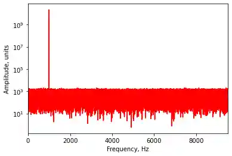

# VoIP to Audio Decoder Using Raspberry Pi
Intership project (4th year)

**Author**: Benoît Vidotto

**Polytech Mons (FPMs), UMONS, Belgium**

   

      
      

<em>A schema of the testing protocol.</em>
   

---

This project focuses on transforming Raspberry Pi devices into 4-channel SIP phones. This endeavor aims not only to innovate but also to perform a comparative study against existing SIP phones in terms of cost and performance.

   

      
      

<em>The architecture.</em>
   

### Key Components:
Utilizing the Asterisk software on the company's servers, this project enables effective VoIP communication, promising to enhance connectivity solutions.

## Equipment: Raspberry Pi

- **Model:** Raspberry Pi 3B+
- **Description:** A compact mini-computer approximately the size of a credit card, ideal for various applications.
- **Operating System:** Built on a Linux foundation, offering flexibility and performance.
- **Power Supply:** Operates on a 5-volt input, ensuring energy efficiency.
- **Storage:** Supports micro-SD cards, providing ample space for applications.
- **Audio Codecs:** Equipped with high-definition codecs for superior audio quality.
- **Cost:** Each unit was acquired for €34.72, representing a cost-effective solution for this project.

   

      
      

<em>The Raspberry Pi 3B+</em>
   

## Additional Equipment: Terracom TERRA-IEX & Zycoo X10

To effectively compare the Raspberry Pi solution, two existing SIP phones were evaluated:

- **Terracom TERRA-IEX:** A premium device priced between €500 and €700, offering high-end features.
- **Zycoo X10:** More affordable, priced between €120 and €200, providing basic functionalities.

   

      
      
      

<em>TERRA_IEX (left) and Zycoo X1 (right)</em>
   

## Cost Analysis

For a complete 4-channel SIP phone setup, the following components are necessary:
- **Network Switch:** To efficiently share the Ethernet connection across devices.
- **Power Supply:** A 5-volt power supply and a converter (12 or 24 volts) for the TERRA and Zycoo devices.

### Cost Efficiency
The Raspberry Pi prototype is exceptionally cost-effective, being **13 times cheaper** than the TERRA-IEX and **4 times cheaper** than the Zycoo, making it an attractive alternative for companies seeking to optimize costs without compromising quality.

   

      
      

<em>Cost analysis of the different options (Food has been wrongly translated from "Power Supply")</em>
   

## Testing Protocol

To ensure the system operates effectively, a structured testing protocol was implemented:

1. Alice initiates a call to Bob through the server, playing an audio signal.
2. The Asterisk server efficiently redirects the call to Bob.
3. Bob accepts the call and sends the audio signal back to Alice via an audio cable.
4. Alice records the audio signal received for analysis.

   

      
      

<em>A schema of the testing protocol.</em>
   

### Normalized Volume
To maintain consistent sound levels and avoid distortion, all SIP phones were calibrated using an oscilloscope prior to testing.

   

      
      
      
      

<em>Raspberry Pi (left), Zycoo X1 (middle) and TERRA-IEX (right)</em>
   

## Testing Results: Frequency at 1 kHz

The tests aimed to determine the presence of harmonics and their amplitudes compared to the source signal. The results revealed that:

- The Raspberry Pi outperformed its competitors, showcasing its superior audio processing capabilities.
- The TERRA-IEX, conversely, displayed significantly poorer performance.

   

      
      

<em>Source at 1 kHz.</em>
   

   

      
      
      
      

<em>Resulting tests for the devices? Raspberry Pi (left), Zycoo X1 (middle) and TERRA-IEX (right)</em>
   

## Testing Results: Frequency Sweep from 300 to 3400 Hz

This phase involved comparing the audio fidelity of the three devices over a range of frequencies (frequencies heard by humans). Key observations included:

- The device curves were expected to closely match the source curve.
- Any harmonics outside the designated frequency band were considered noise interference.
- Again, the Raspberry Pi demonstrated superior performance, while the TERRA-IEX exhibited serious deficiencies.

   

      
      

<em>Source from 300 to 3400 kHz.</em>
   

   

      
      
      
      

<em>Resulting tests for the devices. Raspberry Pi (left), Zycoo X1 (middle) and TERRA-IEX (right)</em>
   

## Conclusion - VoIP

The Raspberry Pi prototype reveals a compelling case for its adoption:
- It offers substantial cost savings compared to both competitors.
- The audio quality is notably superior, making it suitable for various communication needs.
- Its compact size enhances practicality, allowing for easy integration into existing systems.

   

      
      

<em>Work setup</em>
   

### Improvement Prospects
Looking ahead, several enhancements can be made:
- **Custom Enclosure:** Developing an appropriate enclosure to house the prototype, ideally measuring a minimum of 15x15x15 cm, to ensure durability and aesthetic appeal.

   

      
      

<em>A concept of a box containing the 4 Raspberrys stacked.</em>
   

      

      
      

<em>The Raspberrys stacked.</em>
   

- **Web Interface:** Creating a user-friendly web interface to streamline communication between the Raspberry Pi and PC, enhancing user interaction.

   

      
      
      

<em>Existing command line interface.</em>
   

### Installation
Instructions for the installation on Raspberry are available in raspberry.md

## Authors & contributors

The original setup of this repository is by [Benoît Vidotto](https://github.com/bvidotto).

## License

MIT License

Copyright (c) 2024 Benoît Vidotto

Permission is hereby granted, free of charge, to any person obtaining a copy
of this software and associated documentation files (the "Software"), to deal
in the Software without restriction, including without limitation the rights
to use, copy, modify, merge, publish, distribute, sublicense, and/or sell
copies of the Software, and to permit persons to whom the Software is
furnished to do so, subject to the following conditions:

The above copyright notice and this permission notice shall be included in all
copies or substantial portions of the Software.

THE SOFTWARE IS PROVIDED "AS IS", WITHOUT WARRANTY OF ANY KIND, EXPRESS OR
IMPLIED, INCLUDING BUT NOT LIMITED TO THE WARRANTIES OF MERCHANTABILITY,
FITNESS FOR A PARTICULAR PURPOSE AND NONINFRINGEMENT. IN NO EVENT SHALL THE
AUTHORS OR COPYRIGHT HOLDERS BE LIABLE FOR ANY CLAIM, DAMAGES OR OTHER
LIABILITY, WHETHER IN AN ACTION OF CONTRACT, TORT OR OTHERWISE, ARISING FROM,
OUT OF OR IN CONNECTION WITH THE SOFTWARE OR THE USE OR OTHER DEALINGS IN THE
SOFTWARE.